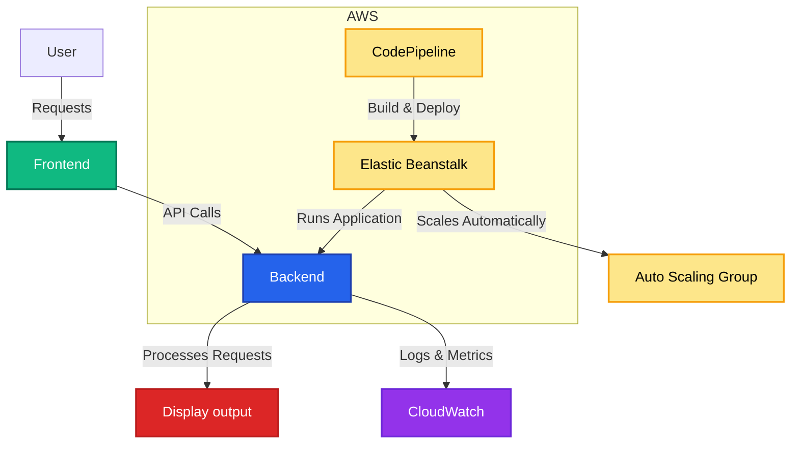

# Student Exam Performance Prediction - Documentation

## Overview

This project aims to predict student exam performance by leveraging machine learning techniques. The system is fully deployed on AWS Elastic Beanstalk, ensuring scalability and seamless accessibility. Configuration and environment settings are managed via the .ebextensions directory, streamlining deployment and maintenance. AWS CodePipeline is integrated for continuous deployment, automating the build and deployment processes. This system provides valuable insights into student performance trends by processing student data, applying ML models, and hosting an API.

## Features

- Comprehensive data preprocessing for handling missing values and feature scaling.

- Training and evaluation of multiple machine learning models to find best & use model with best accuracy.

- RESTful API deployment for seamless integration with other applications.

- Scalable infrastructure through AWS Elastic Beanstalk, supporting high availability.

- Continuous deployment via AWS CodePipeline, automating testing and deployment.

- Logging and error tracking mechanisms to ensure smooth operation.

## Tech Stack

- Backend: Python (Flask/FastAPI) for handling API requests and serving predictions.

- Machine Learning: Scikit-learn for model training, Pandas for data manipulation, and NumPy for numerical computations.

- Deployment: AWS Elastic Beanstalk for hosting the application with auto-scaling capabilities.

- CI/CD: AWS CodePipeline for automated deployment and testing.

Database (Optional): PostgreSQL or SQLite for logging predictions and storing student data.

## System Architecture:

## Installation & Setup

1. Clone the repository:
```bash
git clone https://github.com/your-repo/student-performance-prediction.git
```
2. Navigate to the project directory:
```bash
cd student-performance-prediction
```
3. Create and activate a virtual environment (optional but recommended):
```bash
python -m venv env
source env/bin/activate   # On macOS/Linux
env\Scripts\activate      # On Windows
```
4. Install dependencies:
```bash
pip install -r requirements.txt
```
5. Run the application locally:
```bash
python app.py
```
6. Access the API through:
```bash
http://localhost:5000/predict
```

## .ebextensions Configuration

The project includes an .ebextensions directory containing essential configuration files for Elastic Beanstalk. These files ensure that environment variables, dependencies, and server configurations are correctly set up.

## Future Enhancements

- Implement deep learning models to improve prediction accuracy.

- Add real-time data streaming for continuous student performance monitoring.

- Integrate additional APIs for external data enrichment, such as attendance records and behavioral analysis.

- Enhance CI/CD workflows with automated testing and monitoring via AWS CodePipeline.
